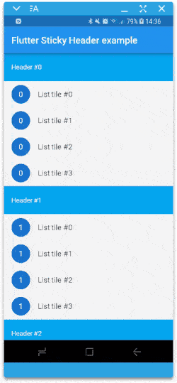
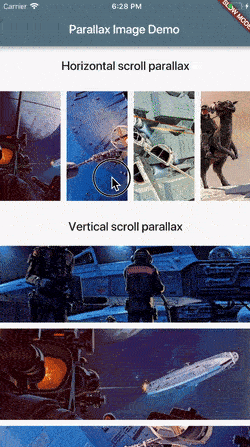
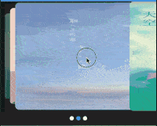
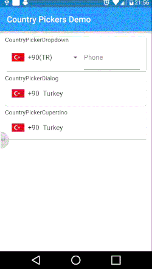

# List of Awesome Flutter Packages [](https://github.com/leisim/awesome-flutter-plugins)
A curated list of awesome Flutter packages.

Is your favourite package missing? Let me know or create a pull request...

## Index
- [Widgets](#Widgets)
- [Animations](#Animations)
- [Images](#Images)
- [Swipe & Slide](#Swipe--Slide)
- [Dialogs & Popups](#Dialogs--Popups)
- [Labels & Forms](#Labels--Forms)
- [Device](#Device)
- [Networking](#Networking)
- [Bluetooth & Wifi](#Bluetooth--Wifi)
- [Utils](#Utils)
- [Frameworks & Design Patterns](#Frameworks--Design-Patterns)
- [Audio & Video](#Audio--Video)
- [Files](#Files)
- [Persistance](#Persistance)
- [Logging & Error Handling](#Logging--Error-Handling)

<br>

# Widgets

## WebView for Flutter (Flutter Team) [](https://pub.dartlang.org/packages/webview_flutter) [](https://github.com/flutter/plugins/tree/master/packages/webview_flutter) [](https://github.com/flutter/plugins/tree/master/packages/webview_flutter)

A Flutter plugin that provides a WebView widget on Android and iOS.

On iOS the WebView widget is backed by a `WKWebView`; On Android the WebView widget is backed by a `WebView`.

---

## Splash Screen [](https://pub.dartlang.org/packages/splashscreen) [](https://github.com/KarimMohamed2005/SplashScreenFlutterPackage) [](https://github.com/KarimMohamed2005/SplashScreenFlutterPackage)

Easy to use splash screen package.


---

## auto_size_text [](https://pub.dartlang.org/packages/auto_size_text) [](https://github.com/leisim/auto_size_text) [](https://github.com/leisim/auto_size_text)

Flutter widget that automatically resizes text to fit perfectly within its bounds.


---

## Flutter Sticky Headers [](https://pub.dartlang.org/packages/sticky_headers) [](https://github.com/fluttercommunity/flutter_sticky_headers) [](https://github.com/fluttercommunity/flutter_sticky_headers)

Lets you place headers on scrollable content that will stick to the top of the container whilst the content is scrolled.


---

## flutter_sticky_header [](https://pub.dartlang.org/packages/flutter_sticky_header) [](https://github.com/letsar/flutter_sticky_header) [](https://github.com/letsar/flutter_sticky_header)

Flutter implementation of sticky headers as a sliver. Use it in a CustomScrollView.



---

## Infinite ListView [](https://pub.dartlang.org/packages/infinite_listview) [](https://github.com/fluttercommunity/flutter_infinite_listview) [](https://github.com/fluttercommunity/flutter_infinite_listview)

ListView with items that can be scrolled infinitely in both directions.


---

## Draggable Scrollbar [](https://pub.dartlang.org/packages/draggable_scrollbar) [](https://github.com/fluttercommunity/flutter-draggable-scrollbar) [](https://github.com/fluttercommunity/flutter-draggable-scrollbar)

A scrollbar that can be dragged for quickly navigation through a vertical list. Additionaly it can show label next to scrollthumb with information about current item, for example date of picture created.


<br>

# Animations

## ✨Flutter Spinkit [](https://pub.dartlang.org/packages/flutter_spinkit) [](https://github.com/jogboms/flutter_spinkit) [](https://github.com/jogboms/flutter_spinkit)

A collection of loading indicators animated with flutter.


---

## Shimmer [](https://pub.dartlang.org/packages/shimmer) [](https://github.com/hnvn/flutter_shimmer) [](https://github.com/hnvn/flutter_shimmer)

A package provides an easy way to add shimmer effect in Flutter project.


---

## Animated Text Kit [](https://pub.dartlang.org/packages/animated_text_kit) [](https://github.com/aagarwal1012/Animated-Text-Kit/) [](https://github.com/aagarwal1012/Animated-Text-Kit/)

A flutter package project which contains a collection of cool and beautiful text animations.

<p>
	
	
    
    
</p>

---

## spritewidget [](https://pub.dartlang.org/packages/spritewidget) [](https://github.com/spritewidget/spritewidget) [](https://github.com/spritewidget/spritewidget)

SpriteWidget is a toolkit for building complex, high performance animations and 2D games with Flutter. Your sprite render tree lives inside a widget that mixes seamlessly with other Flutter and Material widgets. You can use SpriteWidget to create anything from an animated icon to a full fledged game.

---

## flutter_sequence_animation [](https://pub.dartlang.org/packages/flutter_sequence_animation) [](https://github.com/Norbert515/flutter_sequence_animation) [](https://github.com/Norbert515/flutter_sequence_animation)

Composite together any animation with this robust and simple to use package.

<p>
	
	
</p>

---

## flutter_villains [](https://pub.dartlang.org/packages/flutter_villains) [](https://github.com/Norbert515/flutter_villains) [](https://github.com/Norbert515/flutter_villains)

Page transitions with just a few lines of code. What are heroes without villains?


---

## Flutter Page Transition Package [](https://pub.dartlang.org/packages/page_transition) [](https://github.com/kalismeras61/flutter_page_transition) [](https://github.com/kalismeras61/flutter_page_transition)

This package gives you beautiful page transitions.


---

## Wave [](https://pub.dartlang.org/packages/wave) [](https://github.com/TheProtoss/wave) [](https://github.com/TheProtoss/wave)

Widget for displaying waves with custom color, duration, floating and blur effects.


---

## flip_card [](https://pub.dartlang.org/packages/flip_card) [](https://github.com/fedeoo/flip_card/) [](https://github.com/fedeoo/flip_card/)

A component that provides flip card animation. It could be used for hide and show details of a product.

<p>
	
	
</p>

---

## fluttie: Lottie for flutter [](https://pub.dartlang.org/packages/fluttie) [](https://github.com/simolus3/fluttie) [](https://github.com/simolus3/fluttie)

Fluttie allows you to easily display stunning Lottie animations in flutter.


---

## flip_panel [](https://pub.dartlang.org/packages/flip_panel) [](https://github.com/hnvn/flutter_flip_panel) [](https://github.com/hnvn/flutter_flip_panel)

A package for flip panel with built-in animation.

<p>
	
	
</p>

---

## flame [](https://pub.dartlang.org/packages/flame) [](https://github.com/luanpotter/flame) [](https://github.com/luanpotter/flame)

A minimalist Flutter game engine, provides a nice set of somewhat independent modules you can choose from.

```dart
import 'package:flame/components/component.dart';

Sprite sprite = new Sprite('player.png');

const size = 128.0;
final player = new SpriteComponent.fromSprite(size, size, sprite); // width, height, sprite

player.x = ... // 0 by default
player.y = ... // 0 by default
player.angle = ... // 0 by default

// on your render method...
player.render(canvas);
```

---

## drawing_animation [](https://pub.dartlang.org/packages/drawing_animation) [](https://github.com/biocarl/drawing_animation) [](https://github.com/biocarl/drawing_animation)

An dart-only library for gradually painting SVG path objects on canvas (drawing line animation).


<br>

# Images

## Image Picker (Flutter Team) [](https://pub.dartlang.org/packages/image_picker) [](https://github.com/flutter/plugins/tree/master/packages/image_picker) [](https://github.com/flutter/plugins/tree/master/packages/image_picker)

A Flutter plugin for iOS and Android for picking images from the image library, and taking new pictures with the camera.

---

## CachedNetworkImage [](https://pub.dartlang.org/packages/cached_network_image) [](https://github.com/renefloor/flutter_cached_network_image) [](https://github.com/renefloor/flutter_cached_network_image)

A flutter library to show images from the internet and keep them in the cache directory.

```dart
CachedNetworkImage(
  imageUrl: "http://via.placeholder.com/350x150",
  placeholder: (context, url) => CircularProgressIndicator(),
  errorWidget: (context, url, error) => Icon(Icons.error),
)
```

---

## flutter_svg [](https://pub.dartlang.org/packages/flutter_svg) [](https://github.com/dnfield/flutter_svg) [](https://github.com/dnfield/flutter_svg)

An SVG rendering and widget library for Flutter, which allows painting and displaying Scalable Vector Graphics 1.1 files.

```dart
final String assetName = 'assets/image.svg';
final Widget svg = new SvgPicture.asset(
  assetName,
  semanticsLabel: 'Acme Logo'
);
```

---

## Flutter Photo View [](https://pub.dartlang.org/packages/photo_view) [](https://github.com/renancaraujo/photo_view) [](https://github.com/renancaraujo/photo_view)

A simple zoomable image widget for Flutter.

Resolves a image provider and shows the result with useful gestures support, such as pinch to zoom and pan.


---

## Image Cropper [](https://pub.dartlang.org/packages/image_cropper) [](https://github.com/hnvn/flutter_image_cropper) [](https://github.com/hnvn/flutter_image_cropper)

A Flutter plugin for Android and iOS supports cropping images.

<p>
	
	
</p>

---

## Flutter Advanced Network Image [](https://pub.dartlang.org/packages/flutter_advanced_networkimage) [](https://github.com/mchome/flutter_advanced_networkimage) [](https://github.com/mchome/flutter_advanced_networkimage)

An advanced image provider provides caching and retrying for flutter app. Now with zoomable widget and transition to image widget

```dart
Image(
  image: AdvancedNetworkImage(
    url,
    header: header,
    useDiskCache: true,
    cacheRule: CacheRule(maxAge: const Duration(days: 7)),
  ),
  fit: BoxFit.cover,
)
```

---

## Flutter Multi Image Picker [](https://pub.dartlang.org/packages/multi_image_picker) [](https://github.com/Sh1d0w/multi_image_picker) [](https://github.com/Sh1d0w/multi_image_picker)

Flutter plugin that allows you to display multi image picker on iOS and Android.


---

## flutter_image_compress [](https://pub.dartlang.org/packages/flutter_image_compress) [](https://github.com/OpenFlutter/flutter_image_compress) [](https://github.com/OpenFlutter/flutter_image_compress)

Compress images with native code (objc kotlin), it's faster. This package supports Android and iOS.

```dart
var result = await FlutterImageCompress.compressWithFile(
  file.absolute.path,
  minWidth: 2300,
  minHeight: 1500,
  quality: 94,
  rotate: 90,
);
```

---

## Material Design Icons [](https://pub.dartlang.org/packages/material_design_icons_flutter) [](https://github.com/ziofat/material_design_icons_flutter) [](https://github.com/ziofat/material_design_icons_flutter)

The Material Design Icons from the community for Flutter.


---

## parallax_image [](https://pub.dartlang.org/packages/parallax_image) [](https://github.com/pulyaevskiy/parallax-image) [](https://github.com/pulyaevskiy/parallax-image)

A Flutter widget that paints an image and moves it at a slower speed than the main scrolling content.



---

## Image Cropping plugin [](https://pub.dartlang.org/packages/image_crop) [](https://github.com/VolodymyrLykhonis/image_crop) [](https://github.com/VolodymyrLykhonis/image_crop)
A flutter plugin to crop image on iOS and Android. It processes image files off main thread natively. The plugin provides a Crop widget to display image cropping to a user.

<p>
	
	
</p>

---

## Pinch Zoom Image [](https://pub.dartlang.org/packages/pinch_zoom_image) [](https://github.com/YoussefKababe/pinch_zoom_image) [](https://github.com/YoussefKababe/pinch_zoom_image)

A widget that makes picture pinch zoom, then return back to initial size and position when released.

<p>
	
	
</p>

---

## image [](https://pub.dartlang.org/packages/image) [](https://github.com/brendan-duncan/image) [](https://github.com/brendan-duncan/image)

Provides server and web apps the ability to load, manipulate, and save images with various image file formats including PNG, JPEG, GIF, WebP, TIFF, TGA, PSD, PVR, and OpenEXR.

```dart
Image image = decodeImage(Io.File('test.webp').readAsBytesSync());

// Resize the image to a 120x? thumbnail (maintaining the aspect ratio).
Image thumbnail = copyResize(image, 120);

// Save the thumbnail as a PNG.
Io.File('thumbnail.png')
  ..writeAsBytesSync(encodePng(thumbnail));
```

<br>

# Swipe & Slide

## flutter_swiper [](https://pub.dartlang.org/packages/flutter_swiper) [](https://github.com/jzoom/flutter_swiper) [](https://github.com/jzoom/flutter_swiper)

The best swiper for flutter, with multiple layouts, infinite loop. Compatible with Android & iOS.

<p>
	
	
</p>

---

## flutter_slidable [](https://pub.dartlang.org/packages/flutter_slidable) [](https://github.com/letsar/flutter_slidable) [](https://github.com/letsar/flutter_slidable)

A Flutter implementation of slidable list item with directional slide actions that can be dismissed.


---

## intro_views_flutter [](https://pub.dartlang.org/packages/intro_views_flutter) [](https://github.com/aagarwal1012/IntroViews-Flutter) [](https://github.com/aagarwal1012/IntroViews-Flutter)

A Flutter package for simple material design app intro screens with some cool animations.


---

## carousel_slider [](https://pub.dartlang.org/packages/carousel_slider) [](https://github.com/serenader2014/flutter_carousel_slider) [](https://github.com/serenader2014/flutter_carousel_slider)

A carousel slider widget, support infinite scroll and custom child widget, with auto play feature.


---

## intro_slider [](https://pub.dartlang.org/packages/intro_slider) [](https://github.com/duytq94/flutter-intro-slider) [](https://github.com/duytq94/flutter-intro-slider)

A plugin to help you make intro slider screen to show the major features of your app. You can change the image, button, text style, color, and more things.


---

## smooth_star_rating [](https://pub.dartlang.org/packages/smooth_star_rating) [](https://github.com/thangmam/smoothratingbar.git) [](https://github.com/thangmam/smoothratingbar.git)

A Star rating with touch and swipe rate enabled
- Supports half rate and full rate (1.0 or 0.5)
- Swipe for incrementing/decrementing rate amount
- Change star body and boundary colors independently


<br>

# Dialogs & Popups

## modal_progress_hud [](https://pub.dartlang.org/packages/modal_progress_hud) [](https://github.com/mmcc007/modal_progress_hud) [](https://github.com/mmcc007/modal_progress_hud)

A modal progress indicator widget (HUD = heads-up display). Wrap around another widget to block access to widget during an async call. Also accepts a custom spinner.


---

## file_picker [](https://pub.dartlang.org/packages/file_picker) [](https://github.com/miguelpruivo/plugins_flutter_file_picker) [](https://github.com/miguelpruivo/plugins_flutter_file_picker)

A plugin that allows you to pick absolute paths from diferent file types.


---

## country_pickers [](https://pub.dartlang.org/packages/country_pickers) [](https://github.com/figengungor/country_pickers) [](https://github.com/figengungor/country_pickers)

Countries, codes, flags and several ways of picking them at your service...



---

## Date Range Picker [](https://pub.dartlang.org/packages/date_range_picker) [](https://github.com/anicdh/date_range_picker) [](https://github.com/anicdh/date_range_picker)

Date Range Pickers use a dialog window to select a range of date on mobile.


---

## progress_dialog [](https://pub.dartlang.org/packages/progress_dialog) [](https://github.com/fayaz07/progress_dialog) [](https://github.com/fayaz07/progress_dialog)

A light weight library to easily manage a progress dialog with simple steps whenever you need to do it. You can easily show and hide it.


<br>

# Labels & Forms


<br>

# Device

## device_info (Flutter Team) [](https://pub.dartlang.org/packages/device_info) [](https://github.com/flutter/plugins/tree/master/packages/device_info) [](https://github.com/flutter/plugins/tree/master/packages/device_info)

Flutter plugin providing detailed information about the device (make, model, etc.), and Android or iOS version the app is running on.

```dart
import 'package:device_info/device_info.dart';

DeviceInfoPlugin deviceInfo = DeviceInfoPlugin();
AndroidDeviceInfo androidInfo = await deviceInfo.androidInfo;
print('Running on ${androidInfo.model}');  // e.g. "Moto G (4)"

IosDeviceInfo iosInfo = await deviceInfo.iosInfo;
print('Running on ${iosInfo.utsname.machine}');  // e.g. "iPod7,1"
```

---

## share (Flutter Team) [](https://pub.dartlang.org/packages/share) [](https://github.com/flutter/plugins/tree/master/packages/share) [](https://github.com/flutter/plugins/tree/master/packages/share)

Flutter plugin for sharing content via the platform share UI, using the ACTION_SEND intent on Android and UIActivityViewController on iOS.

```dart
import 'package:share/share.dart';
Share.share('check out my website https://example.com');
```

---

## package_info (Flutter Team) [](https://pub.dartlang.org/packages/package_info) [](https://github.com/flutter/plugins/tree/master/packages/package_info) [](https://github.com/flutter/plugins/tree/master/packages/package_info)

Flutter plugin for querying information about the application package, such as CFBundleVersion on iOS or versionCode on Android.

```dart
import 'package:package_info/package_info.dart';

PackageInfo packageInfo = await PackageInfo.fromPlatform();

String appName = packageInfo.appName;
String packageName = packageInfo.packageName;
String version = packageInfo.version;
String buildNumber = packageInfo.buildNumber;
```

---

## Flutter Geolocator [](https://pub.dartlang.org/packages/geolocator) [](https://github.com/baseflowit/flutter-geolocator) [](https://github.com/baseflowit/flutter-geolocator)

Geolocation plugin for Flutter. This plugin provides a cross-platform (iOS, Android) API for generic location (GPS etc.) functions.

```dart
import 'package:geolocator/geolocator.dart';

Position position = await Geolocator().getCurrentPosition(desiredAccuracy: LocationAccuracy.high);
```

---

## contacts_service [](https://pub.dartlang.org/packages/contacts_service) [](https://github.com/fluttercommunity/flutter_contacts) [](https://github.com/fluttercommunity/flutter_contacts)

A Flutter plugin to retrieve and manage contacts on Android and iOS devices.

```dart
import 'package:contacts_service/contacts_service.dart';

// Get all contacts
Iterable<Contact> contacts = await ContactsService.getContacts();

// Get contacts matching a string
Iterable<Contact> johns = await ContactsService.getContacts(query : "john");

await ContactsService.addContact(newContact);
await ContactsService.deleteContact(contact);
```

---

## Screen [](https://pub.dartlang.org/packages/screen) [](https://github.com/clovisnicolas/flutter_screen) [](https://github.com/clovisnicolas/flutter_screen)

A Flutter plugin to manage the device's screen on Android and iOS.

```dart
import 'package:screen/screen.dart';

// Get the current brightness:
double brightness = await Screen.brightness;

// Set the brightness:
Screen.setBrightness(0.5);

// Check if the screen is kept on:
bool isKeptOn = await Screen.isKeptOn;

// Prevent screen from going into sleep mode:
Screen.keepOn(true);
```

---

## battery [](https://pub.dartlang.org/packages/battery) [](https://github.com/flutter/plugins/tree/master/packages/battery) [](https://github.com/flutter/plugins/tree/master/packages/battery)

Flutter plugin for accessing information about the battery state (full, charging, discharging) on Android and iOS.

```dart
import 'package:battery/battery.dart';

var battery = Battery();
print(battery.batteryLevel); // Access current battery level

// Be informed when the state (full, charging, discharging) changes
_battery.onBatteryStateChanged.listen((BatteryState state) {
  // Do something with new state
});
```

<br>

# Networking

## url_launcher (Flutter Team) [](https://pub.dartlang.org/packages/url_launcher) [](https://github.com/flutter/plugins/tree/master/packages/url_launcher) [](https://github.com/flutter/plugins/tree/master/packages/url_launcher)

Flutter plugin for launching a URL on Android and iOS. Supports web, phone, SMS, and email schemes.

```dart
import 'package:url_launcher/url_launcher.dart';

const url = 'https://flutter.io';
if (await canLaunch(url)) {
  await launch(url);
} else {
  throw 'Could not launch $url';
}
```

---

## dio [](https://pub.dartlang.org/packages/dio) [](https://github.com/flutterchina/dio) [](https://github.com/flutterchina/dio)

A powerful Http client for Dart, which supports Interceptors, FormData, Request Cancellation, File Downloading, Timeout etc.

```dart
import 'package:dio/dio.dart';
void getHttp() async {
  try {
    Response response = await Dio().get("http://www.google.com");
    return print(response);
  } catch (e) {
    return print(e);
  }
}
```

---

## http (Flutter Team) [](https://pub.dartlang.org/packages/http) [](https://github.com/dart-lang/http) [](https://github.com/dart-lang/http)

A composable, cross-platform, Future-based API for making HTTP requests.

```dart
import 'package:http/http.dart' as http;

http.read("http://example.com/foobar.txt").then(print);
```

---

## Flutter Downloader [](https://pub.dartlang.org/packages/flutter_downloader) [](https://github.com/fluttercommunity/flutter_downloader) [](https://github.com/fluttercommunity/flutter_downloader)

A plugin for creating and managing download tasks. Supports iOS and Android.

This plugin is based on `WorkManager` in Android and `NSURLSessionDownloadTask` in iOS to run download task in background mode.

```dart
final taskId = await FlutterDownloader.enqueue(
  url: 'your download link',
  savedDir: 'the path of directory where you want to save downloaded files',
  showNotification: true, // show download progress in status bar (for Android)
  openFileFromNotification: true, // click on notification to open downloaded file (for Android)
);

FlutterDownloader.registerCallback((id, status, progress) {
  // code to update your UI
});
```

<br>

# Bluetooth & Wifi

## connectivity (Flutter Team) [](https://pub.dartlang.org/packages/connectivity) [](https://github.com/flutter/plugins/tree/master/packages/connectivity) [](https://github.com/flutter/plugins/tree/master/packages/connectivity)

This plugin allows Flutter apps to discover network connectivity and configure themselves accordingly. It can distinguish between cellular vs WiFi connection. This plugin works for iOS and Android.

```dart
import 'package:connectivity/connectivity.dart';

var connectivityResult = await (Connectivity().checkConnectivity());
if (connectivityResult == ConnectivityResult.mobile) {
  // I am connected to a mobile network.
} else if (connectivityResult == ConnectivityResult.wifi) {
  // I am connected to a wifi network.
}
```

---

## flutter_offline [](https://pub.dartlang.org/packages/flutter_offline) [](https://github.com/jogboms/flutter_offline) [](https://github.com/jogboms/flutter_offline)

A tidy utility to handle offline/online connectivity like a Boss. It provides support for both iOS and Android platforms.

```dart
OfflineBuilder(
  connectivityBuilder: (
    BuildContext context,
    ConnectivityResult connectivity,
    Widget child,
  ) {
    final bool connected = connectivity != ConnectivityResult.none;
    return Text(connected ? "online" : "offline");
  },
);
```

---

## FlutterBlue [](https://pub.dartlang.org/packages/flutter_blue) [](https://github.com/pauldemarco/flutter_blue) [](https://github.com/pauldemarco/flutter_blue)

Popular Bluetooth plugin for Flutter

FlutterBlue aims to offer the most from both platforms (iOS and Android).

Using the `FlutterBlue` instance, you can scan for and connect to nearby devices. Once connected to a device, the `BluetoothDevice` object can discover services, characteristics, and descriptors. The `BluetoothDevice` object is then used to directly interact with characteristics and descriptors.

---

## Flutter NFC Reader [](https://pub.dartlang.org/packages/flutter_nfc_reader) [](https://github.com/matteocrippa/flutter-nfc-reader) [](https://github.com/matteocrippa/flutter-nfc-reader)

A new flutter plugin to help developers looking to use internal hardware inside iOS or Android devices for reading NFC tags.

The system activate a pooling reading session that stops automatically once a tag has been recognised. You can also trigger the stop event manually using a dedicated function.

```dart
Future<NfcData> startNFC() async {
   NfcData response;

  try {
    response = await FlutterNfcReader.read;
  } on PlatformException {
    //Something went wrong
  }
    
  return response;
}
```

<br>

# Utils

## RxDart [](https://pub.dartlang.org/packages/rxdart) [](https://github.com/ReactiveX/rxdart) [](https://github.com/ReactiveX/rxdart)
RxDart is a reactive functional programming library for Google Dart, based on ReactiveX.

### Reading the Konami Code

```dart
const konamiKeyCodes = const <int>[
  KeyCode.UP, KeyCode.UP,
  KeyCode.DOWN, KeyCode.DOWN,
  KeyCode.LEFT, KeyCode.RIGHT,
  KeyCode.LEFT, KeyCode.RIGHT,
  KeyCode.B, KeyCode.A
];

  final result = querySelector('#result');
  final keyUp = new Observable<KeyboardEvent>(document.onKeyUp);

  keyUp
    .map((event) => event.keyCode)
    .bufferCount(10, 1)
    .where((lastTenKeyCodes) => const IterableEquality<int>().equals(lastTenKeyCodes, konamiKeyCodes))
    .listen((_) => result.innerHtml = 'KONAMI!');
```

---

## fluro [](https://pub.dartlang.org/packages/fluro) [](https://github.com/theyakka/fluro) [](https://github.com/theyakka/fluro)

Fluro is a Flutter routing library that adds flexible routing options like wildcards, named parameters and clear route definitions.

```dart
var usersHandler = Handler(handlerFunc: (BuildContext context, Map<String, dynamic> params) {
  return UsersScreen(params["id"][0]);
});

final router = Router();
router.define("/users/:id", handler: usersHandler);
```

---

## after_layout [](https://pub.dartlang.org/packages/after_layout) [](https://github.com/fluttercommunity/flutter_after_layout) [](https://github.com/fluttercommunity/flutter_after_layout)

Brings functionality to execute code after the first layout of a widget has been performed, i.e. after the first frame has been displayed.

```dart
class HomeScreen extends StatefulWidget {
  @override
  HomeScreenState createState() => new HomeScreenState();
}

class HomeScreenState extends State<HomeScreen> with AfterLayoutMixin<HomeScreen> {
  @override
  Widget build(BuildContext context) {
    return new Scaffold(body: new Container(color: Colors.red));
  }

  @override
  void afterFirstLayout(BuildContext context) {
    showDialog(
      context: context,
      builder: (context) => AlertDialog(
        content: Text('Hello World'),
      ),
    );
  }
}
```

---

## json_serialize (Flutter Team) [](https://pub.dartlang.org/packages/json_serializable) [](https://github.com/dart-lang/json_serializable) [](https://github.com/dart-lang/json_serializable)

Generates utilities to aid in serializing to/from JSON.

```dart
import 'package:json_annotation/json_annotation.dart';

part 'example.g.dart';

@JsonSerializable(nullable: false)
class Person {
  final String firstName;
  final String lastName;
  final DateTime dateOfBirth;

  Person({this.firstName, this.lastName, this.dateOfBirth});

  factory Person.fromJson(Map<String, dynamic> json) => _$PersonFromJson(json);
  
  Map<String, dynamic> toJson() => _$PersonToJson(this);
}
```

---

## tuple [](https://pub.dartlang.org/packages/tuple) [](https://github.com/dart-lang/tuple) [](https://github.com/dart-lang/tuple)

Tuple data structure.

```dart
var t = const Tuple2<String, int>('a', 10);

print(t.item1); // prints 'a'
print(t.item2); // prints '10'
```

---

## superpower [](https://pub.dartlang.org/packages/superpower) [](https://github.com/leisim/superpower) [](https://github.com/leisim/superpower)

Lists, Iterables and Maps on steroids! 🦄 Extends Lists with negative indices, sort, group, distinct, slice, flatten etc. Inspired by Kotlin.

Just wrap your existing List with $(myList) or create a new empty list with $() and you are good to go.

```dart
var superList = $([0, 10, 100, 1000]);
var sum = superList.sum(); // 1110
var last = superList[-1]; // 1000
var lastTwo = superList.slice(-2); // [100, 1000]
```

<br>

# Frameworks & Design Patterns

## scoped_model [](https://pub.dartlang.org/packages/scoped_model) [](https://github.com/brianegan/scoped_model) [](https://github.com/brianegan/scoped_model)

A Widget that passes a Reactive Model to all of it's children.

A set of utilities that allow you to easily pass a data Model from a parent Widget down to it's descendants. In addition, it also rebuilds all of the children that use the model when the model is updated. This library was originally extracted from the Fuchsia codebase.

```dart
class CounterModel extends Model {
  int _counter = 0;
  int get counter => _counter;

  void increment() {
    _counter++; // First, increment the counter
    notifyListeners(); // Then notify all the listeners.
  }
}

class CounterApp extends StatelessWidget {
  @override
  Widget build(BuildContext context) {
    // Create a `ScopedModel` widget. This will provide the `model` to the children that request it. 
    return ScopedModel<CounterModel>(
      model: CounterModel(),
      child: Column(children: [
        // Create a ScopedModelDescendant. This widget will get the CounterModel from the nearest
        // ScopedModel<CounterModel>. It will rebuild  any time the CounterModel changes
        ScopedModelDescendant<CounterModel>(
          builder: (context, child, model) => Text('${model.counter}'),
        ),
        Text("Another widget that doesn't depend on the CounterModel")
      ]),
    );
  }
}
```

---

## flutter_redux [](https://pub.dartlang.org/packages/flutter_redux) [](https://github.com/brianegan/flutter_redux) [](https://github.com/brianegan/flutter_redux)

A set of utilities that allow you to easily consume a Redux Store to build Flutter Widgets.

### Redux Widgets
- `StoreProvider` - The base Widget. It will pass the given Redux Store to all descendants that request it.
- `StoreBuilder` - A descendant Widget that gets the Store from a StoreProvider and passes it to a Widget builder function.
- `StoreConnector` - A descendant Widget that gets the Store from the nearest StoreProvider ancestor, converts the Store into a ViewModel with the given converter function, and passes the ViewModel to a builder function. Any time the Store emits a change event, the Widget will automatically be rebuilt. No need to manage subscriptions!

---

## flutter_bloc [](https://pub.dartlang.org/packages/flutter_bloc) [](https://github.com/felangel/bloc) [](https://github.com/felangel/bloc)

Flutter Widgets that make it easy to implement the BLoC (Business Logic Component) design pattern. Built to be used with the bloc state management package.

---

## synchronized [](https://pub.dartlang.org/packages/synchronized) [](https://github.com/tekartik/synchronized.dart) [](https://github.com/tekartik/synchronized.dart)

Lock mechanism to prevent concurrent access to asynchronous code.

```dart
import 'package:synchronized/synchronized.dart';

main() async {
  // Use this object to prevent concurrent access to data
  var lock = new Lock();
  ...
  await lock.synchronized(() async {
    // Only this block can run (once) until done
    ...
  });
}
```

---

## Flutter Hooks [](https://pub.dartlang.org/packages/flutter_hooks) [](https://github.com/rrousselGit/flutter_hooks) [](https://github.com/rrousselGit/flutter_hooks)

A flutter implementation of React hooks. It adds a new kind of widget with enhanced code reuse.

```dart
class Example extends HookWidget {
  final Duration duration;

  const Example({@required this.duration});

  @override
  Widget build(BuildContext context) {
    final controller = useAnimationController(duration: duration);
    return Container();
  }
}
```

<br>

# Audio & Video

## Video Player (Flutter Team) [](https://pub.dartlang.org/packages/video_player) [](https://github.com/flutter/plugins/tree/master/packages/video_player) [](https://github.com/flutter/plugins/tree/master/packages/video_player)

A Flutter plugin for iOS and Android for playing back video on a Widget surface.


---

## chewie [](https://pub.dartlang.org/packages/chewie) [](https://github.com/brianegan/chewie) [](https://github.com/brianegan/chewie)

The video player for Flutter with a heart of gold.

The video_player plugin provides low-level access to video playback. Chewie uses the video_player under the hood and wraps it in a friendly Material or Cupertino UI!


---

## audioplayers [](https://pub.dartlang.org/packages/audioplayers) [](https://github.com/luanpotter/audioplayer) [](https://github.com/luanpotter/audioplayer)

A Flutter plugin to play multiple audio files simultaneously (Android/iOS).

<p>
	
	
    
</p>

---

## Flutter Sound [](https://pub.dartlang.org/packages/flutter_sound) [](https://github.com/dooboolab/flutter_sound) [](https://github.com/dooboolab/flutter_sound)

This plugin provides simple recorder and player functionalities for both Android and iOS.


---

## audioplayer [](https://pub.dartlang.org/packages/audioplayer) [](https://github.com/rxlabz/audioplayer) [](https://github.com/rxlabz/audioplayer)

A flutter plugin to play audio files

```dart
AudioPlayer audioPlugin = new AudioPlayer();

audioPlayer.play(kUrl);

audioPlayer.pause();

audioPlayer.stop();
```

<br>

# Files

## path_provider (Flutter Team) [](https://pub.dartlang.org/packages/path_provider) [](https://github.com/flutter/plugins/tree/master/packages/path_provider) [](https://github.com/flutter/plugins/tree/master/packages/path_provider)

A Flutter plugin for finding commonly used locations on the filesystem. Supports iOS and Android.

```dart
Directory tempDir = await getTemporaryDirectory();
String tempPath = tempDir.path;

Directory appDocDir = await getApplicationDocumentsDirectory();
String appDocPath = appDocDir.path;
```

---

## open_file [](https://pub.dartlang.org/packages/open_file) [](https://github.com/crazecoder/open_file) [](https://github.com/crazecoder/open_file)

A plug-in that can call native apps to open files with string result in flutter. Support iOS (UTI) and Android (Intent)

```dart
import 'package:open_file/open_file.dart';

OpenFile.open("/sdcard/example.txt");
```

<br>

# Persistance

## Shared preferences (Flutter Team) [](https://pub.dartlang.org/packages/shared_preferences) [](https://github.com/flutter/plugins/tree/master/packages/shared_preferences) [](https://github.com/flutter/plugins/tree/master/packages/shared_preferences)

Flutter plugin for reading and writing simple key-value pairs. Wraps NSUserDefaults on iOS and SharedPreferences on Android.

```dart
incrementCounter() async {
  SharedPreferences prefs = await SharedPreferences.getInstance();
  int counter = (prefs.getInt('counter') ?? 0) + 1;
  print('Pressed $counter times.');
  await prefs.setInt('counter', counter);
}
```

---

## sqflite [](https://pub.dartlang.org/packages/sqflite) [](https://github.com/tekartik/sqflite) [](https://github.com/tekartik/sqflite)
SQLite plugin for Flutter. Supports both iOS and Android.

- Support transactions and batches
- Automatic version managment during open
- Helpers for insert/query/update/delete queries
- DB operation executed in a background thread on iOS and Android

---

## redux_persist [](https://pub.dartlang.org/packages/redux_persist) [](https://github.com/Cretezy/redux_persist/tree/master/packages/redux_persist) [](https://github.com/Cretezy/redux_persist/tree/master/packages/redux_persist)
Persist Redux state across app restarts in Flutter, Web, or custom storage engines.

Features:
- Save and load from multiple engine (Flutter, Web, File, custom)
- Fully type safe
- Transform state and raw on load/save
- Custom serializers
- Easy to use, integrate into your codebase in a few minutes!

---

## CookieJar [](https://pub.dartlang.org/packages/cookie_jar) [](https://github.com/flutterchina/cookie_jar) [](https://github.com/flutterchina/cookie_jar)
A cookie manager for http requests in Dart, by which you can deal with the complex cookie policy and persist cookies easily.

```dart
import 'package:cookie_jar/cookie_jar.dart';
void main() async {
  List<Cookie> cookies = [new Cookie("name", "wendux"),new Cookie("location", "china")];
  var cj = new CookieJar();
  //Save cookies   
  cj.saveFromResponse(Uri.parse("https://www.baidu.com/"), cookies);
  //Get cookies  
  List<Cookie> results = cj.loadForRequest(Uri.parse("https://www.baidu.com/xx"));
  print(results);  
}  
```

---

## sembast [](https://pub.dartlang.org/packages/sembast) [](https://github.com/tekartik/sembast.dart) [](https://github.com/tekartik/sembast.dart)

NoSQL persistent embedded file system document-based database for Dart VM and Flutter with encryption support.

```dart
await db.put('Simple application', 'title');
await db.put(10, 'version');
await db.put({'offline': true}, 'settings');

// read values
String title = await db.get('title') as String; 
int version = await db.get('version') as int;
Map settings = await db.get('settings') as Map;
  
// ...and delete
await db.delete('version');
```

---

## objectdb_flutter [](https://pub.dartlang.org/packages/objectdb_flutter) [](https://github.com/netz-chat/objectdb_flutter) [](https://github.com/netz-chat/objectdb_flutter)
Reactive ObjectDB helper.

```dart
db = ObjectDB(File(dbFilePath));
db.open();
// insert sample data
db.insert({
  'name': {'first': 'Alex', 'last': 'Boyle'},
  'message': 'abc',
  'active': true,
  'count': 0,
});
```

---

## mkvv_flutter [](https://pub.dartlang.org/packages/mmkv_flutter) [](https://github.com/yuyongmao/mmkv_flutter) [](https://github.com/yuyongmao/mmkv_flutter)

Plugin that allow Flutter to read value from persistent storage or save value to persistent storage base on MMKV framewor.

```dart
MmkvFlutter mmkv = await MmkvFlutter.getInstance();

mmkv.setBool('boolKey', true);
print('get bool value is ${ await mmkv.getBool('boolKey')}');

String stringtest = await mmkv.getString('stringKey') + '1';
print('GetSetStringTest value is $stringtest');
await mmkv.setString('stringKey', stringtest);
```

<br>

# Logging & Error Handling

## logging (Flutter Team) [](https://pub.dartlang.org/packages/logging) [](https://github.com/dart-lang/logging) [](https://github.com/dart-lang/logging)

Provides APIs for debugging and error logging. This library introduces abstractions similar to those used in other languages, such as the Closure JS Logger and java.util.logging.Logger.

```dart
Logger.root.level = Level.ALL;
Logger.root.onRecord.listen((LogRecord rec) {
  print('${rec.level.name}: ${rec.time}: ${rec.message}');
});
```

---

## catcher [](https://pub.dartlang.org/packages/catcher) [](https://github.com/jhomlala/catcher) [](https://github.com/jhomlala/catcher)

Plugin for error catching. Allows handling errors when they're not catched by developer. Plugin provides multiple handlers for errors.

```dart
main() {
  var debugOptions = CatcherOptions(
    DialogReportMode(),
    [ConsoleHandler()],
  );
  var releaseOptions = CatcherOptions(
    DialogReportMode(),
    [EmailManualHandler(["recipient@email.com"])],
  );

  Catcher(MyApp(), debugConfig: debugOptions, releaseConfig: releaseOptions);
}
```